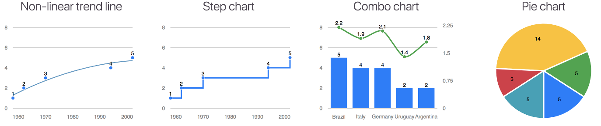

# Morris.js06 - pretty time-series line graphs

This is an improved work of the great plugin [morris.js](https://github.com/morrisjs/morris.js), the simplest chart library for javascript!


Examples can be seen in [action](https://pierresh.github.io/morris.js/image.html) and their source codes are available [here](https://github.com/pierresh/morris.js/blob/master/examples/image.html)

## Changelog
### 0.6.9 (3rd July 2021)
- Polar pie chart

### 0.6.7 & 0.6.8 (21st February 2021)
- npm import (ES6 Module) [Issue #4](https://github.com/pierresh/morris.js/issues/4)
- TypeScript type definitions


### 0.6.6 (12th May 2020)
- Escaping of labels refactored [Issue #15](https://github.com/pierresh/morris.js/issues/15)


### 0.6.5 (4th May 2020)
- option to display percentage in donut [Issue #12](https://github.com/pierresh/morris.js/issues/12)
- options pointSize and lineWidth for line curves in combo charts
- Display Pie\Donut value when there is only 1 value
- Escape labels in hover [Pull #464](https://github.com/morrisjs/morris.js/pull/464)
- option gridIntegers [Issue #344](https://github.com/morrisjs/morris.js/pull/344)
- Add lineType vertical for line charts [Issue #634](https://github.com/morrisjs/morris.js/issues/634)


### 0.6.4 (19th July 2019)
- display segments in pie charts even if total = 0 [Issue #13](https://github.com/pierresh/morris.js/issues/13)
- can add padding to pie charts [Issue #9](https://github.com/pierresh/morris.js/issues/9)
- options extraClassLine and extraClassCircle for line charts [Issue #7](https://github.com/pierresh/morris.js/pull/7)
- option to display customized text when pie chart has no data [Issue #705](https://github.com/morrisjs/morris.js/issues/705)

### 0.6.3 (16th September 2018)
- PostUnits and preUnits for pie chart added
- Method to destroy [Issue #569](https://github.com/morrisjs/morris.js/issues/569)
- Ymin2 and Ymax2 are now considered [Issue #5](https://github.com/pierresh/morris.js/issues/5)

### 0.6.2 (13th March 2018)
- Color data labels is defined automatically (black or white) according to color of element
- Can display colored regions [Issue #723](https://github.com/morrisjs/morris.js/issues/723)
- Add option pointSuperimposed [Issue #3](https://github.com/pierresh/morris.js/issues/3)
- Vertical grid can be dashed / dotted / …
- Animation of area chart improved
- Many other minor improvements

### 0.6.1 (13th February 2018)
- Step line added, based on [PR #331](https://github.com/morrisjs/morris.js/pull/331)
- Trend line can be non-linear (polynomial, logarithmic, exponential)
- Goals options for the right Y-axis [Issue #1](https://github.com/pierresh/morris.js/issues/1)
- Many other minor improvements

### 0.6.0 (8th January 2018)

- Combo Charts - Bar and Line together
- Right Y-axis [Issue #113](https://github.com/morrisjs/morris.js/issues/113)
- Pie chart type added
- Remove jQuery dependencies, based on [PR #503](https://github.com/morrisjs/morris.js/pull/503)
- Animation for every chart, based on [PR #62](https://github.com/morrisjs/morris.js/pull/62) for line chart and [PR #559](https://github.com/morrisjs/morris.js/pull/559) and for bar chart
- Labels for every chart, based on [PR #688](https://github.com/morrisjs/morris.js/pull/688)
- Orders of label in hover [Issue #534](https://github.com/morrisjs/morris.js/issues/534)
- Remove null values from computation of trend line
- Show a bar for value zero in a Bar charts  [Issue #744](https://github.com/morrisjs/morris.js/issues/744)
- Color scheme changed to Bootstrap 4's default theme
- Option to display percentage in Donut and Pie charts

### :heart: Like it? :heart:

:star: Star it! :star:

## Installation
You can download the latest version of Morris.js06 from the [GitHub releases](https://github.com/pierresh/morris.js/releases/latest).

To install via npm:

```bash
npm install morris.js06
```

## Requirements

- [Raphael.js](http://raphaeljs.com/) (>= 2.0)
- [Regression.js](https://github.com/Tom-Alexander/regression-js/releases/tag/1.4.0) (1.4.0) for trendline type polynomial, logarithmic, exponential


## Development

Very daring.

Fork, hack, possibly even add some tests, then send a pull request :)

Remember that Morris.js is a coffeescript project. Please make your changes in
the `.coffee` files, not in the compiled javascript files in the root directory
of the project.

### Developer quick-start

You'll need [node.js](https://nodejs.org).  I recommend using
[nvm](https://github.com/creationix/nvm) for installing node in
development environments.

With node installed, install [grunt](https://github.com/cowboy/grunt) using
`npm install -g grunt-cli`, and then the rest of the test/build dependencies
with `npm install` in the morris.js project folder.

Additionally, [bower](http://bower.io/) is required for for retrieving additional test dependencies.
Install it with `npm install -g bower` and then `bower install` in the morris project folder.

Once you're all set up, you can compile, minify and run the tests using `grunt`.


## License

Copyright (c) 2012-2014, Olly Smith
All rights reserved.

Redistribution and use in source and binary forms, with or without
modification, are permitted provided that the following conditions are met:

1. Redistributions of source code must retain the above copyright notice, this
   list of conditions and the following disclaimer.
2. Redistributions in binary form must reproduce the above copyright notice,
   this list of conditions and the following disclaimer in the documentation
   and/or other materials provided with the distribution.

THIS SOFTWARE IS PROVIDED BY THE COPYRIGHT HOLDERS AND CONTRIBUTORS "AS IS" AND
ANY EXPRESS OR IMPLIED WARRANTIES, INCLUDING, BUT NOT LIMITED TO, THE IMPLIED
WARRANTIES OF MERCHANTABILITY AND FITNESS FOR A PARTICULAR PURPOSE ARE
DISCLAIMED. IN NO EVENT SHALL THE COPYRIGHT OWNER OR CONTRIBUTORS BE LIABLE FOR
ANY DIRECT, INDIRECT, INCIDENTAL, SPECIAL, EXEMPLARY, OR CONSEQUENTIAL DAMAGES
(INCLUDING, BUT NOT LIMITED TO, PROCUREMENT OF SUBSTITUTE GOODS OR SERVICES;
LOSS OF USE, DATA, OR PROFITS; OR BUSINESS INTERRUPTION) HOWEVER CAUSED AND
ON ANY THEORY OF LIABILITY, WHETHER IN CONTRACT, STRICT LIABILITY, OR TORT
(INCLUDING NEGLIGENCE OR OTHERWISE) ARISING IN ANY WAY OUT OF THE USE OF THIS
SOFTWARE, EVEN IF ADVISED OF THE POSSIBILITY OF SUCH DAMAGE.


## My other projects :)
- [flightphp-skeleton](https://github.com/pierresh/flightphp-skeleton): a simple starter kit to build scalable REST APIs with FlightPHP
- [multiple-emails.js](https://github.com/pierresh/multiple-emails.js): Enter multiple emails in a single input field with jQuery

